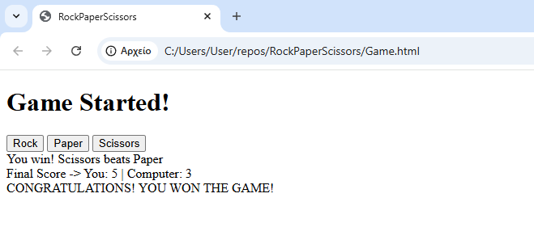

# 🎮 Rock Paper Scissors (Browser Edition)

A fully interactive implementation of the classic "Rock, Paper, Scissors" game, built with **HTML5** and **Vanilla JavaScript**. 

Unlike console-based versions, this project features a Graphical User Interface (GUI) where players interact via buttons, and the DOM is dynamically updated to show results and scores in real-time.


## 📖 Table of Contents
- [Demo](#-demo)
- [Features](#-features)
- [Technologies Used](#-technologies-used)
- [How to Run](#-how-to-run)
- [Code Analysis](#-code-analysis)
- [Future Improvements](#-future-improvements)

## 📸 Demo

**

> The game runs directly in the browser. The player competes against a computer opponent until one side reaches **5 points**.

## 🚀 Features

* **Interactive UI:** No more console prompts! Users make choices by clicking buttons.
* **Randomized AI:** The computer selects its move dynamically using `Math.random()`.
* **Score Tracking:** Global variables track the score, which updates live on the screen after every round.
* **Win Condition:** The game automatically detects when a player reaches 5 points and announces the final winner (or a draw).
* **DOM Manipulation:** Uses JavaScript to create and modify HTML content dynamically.

## 🛠 Technologies Used

* **HTML5:** Provides the semantic structure for the game board and controls.
* **JavaScript (ES6):** Handles the game loop, logic, event listeners, and DOM updates.
* **Git:** Version control.

## 💻 How to Run

Since this is a client-side project, you do not need to install any dependencies or use a package manager like npm.

1.  **Clone the Repository:**
    ```bash
    git clone [https://github.com/themisbog/RockPaperScissors.git](https://github.com/themisbog/RockPaperScissors.git)
    ```
2.  **Navigate to the Folder:**
    ```bash
    cd RockPaperScissors

    ```
3.  **Launch the Game:**
    * Simply double-click the `Game.html` file.
    * OR, if you use VS Code, right-click `Game.html` and select "Open with Live Server".

## 🧠 Code Analysis

This project transitions from basic logic to event-driven programming. Here is a breakdown of the core logic implemented in `RockScissors.js`:

### 1. The Computer's Choice
The function `getComputerChoice()` utilizes `Math.random()` to generate a float between 0 and 1.
* **0.00 - 0.33:** Returns "Rock"
* **0.33 - 0.66:** Returns "Paper"
* **0.66 - 1.00:** Returns "Scissors"

### 2. Event Listeners
Instead of a loop, the game relies on **Event Listeners**. We select the buttons using `document.querySelector` and attach `click` events. This ensures the game only advances when the user is ready.

```javascript
const btn1 = document.querySelector("#btnRock");
btn1.addEventListener("click", () => {
  playRound("rock", getComputerChoice());    
});