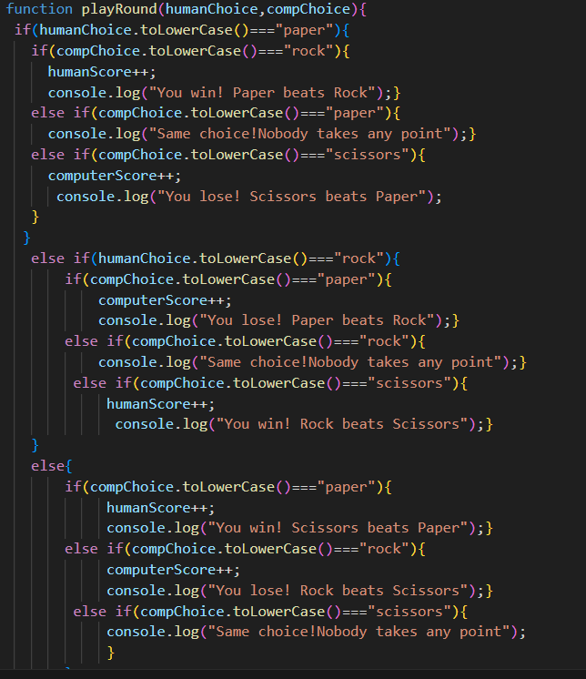
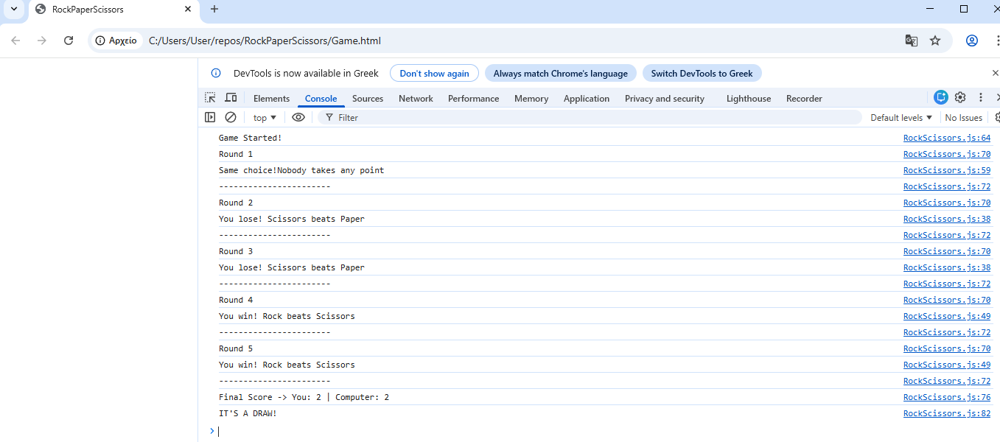

# Rock Paper Scissors (Console Edition)

A classic implementation of the "Rock, Paper, Scissors" game, played entirely within the browser's developer console. This project is part of The Odin Project's JavaScript curriculum.

## 📖 Description

This program is a JavaScript simulation of the game Rock Paper Scissors. It focuses on the fundamental logic of programming, including:
* Function declaration and invocation.
* Conditional statements (`if`/`else`).
* Random selection logic.
* User input via `prompt()`.
* Scope management.

The game consists of a **5-round match** against the computer. The score is tracked globally, and a final winner is declared after all rounds are completed.

## 🚀 Features

* **Randomized Computer Logic:** The computer randomly selects Rock, Paper, or Scissors using `Math.random()`.
* **User Input:** Accepts user choices via a browser prompt.
* **Case Insensitivity:** Inputs like "rock", "Rock", and "ROCK" are all accepted as valid.
* **Score Tracking:** Keeps a running tally of the Human vs. Computer score.
* **Game Loop:** Automatically plays through 5 rounds before ending.

## 📸 Screenshots

### 1. The Game Logic
*Below is a snippet of the core function that determines the winner of a single round.*

![Code Snippet]

### 2. Gameplay in Action
*The game runs entirely in the console. Here is the output after playing 5 rounds.*

![Console Output]

## 🛠️ Technologies Used

* **HTML5:** Used strictly as a container to load the script.
* **JavaScript (ES6):** Handles all game logic, DOM manipulation is not used in this version.
* **Git & GitHub:** Version control and hosting.

## 💻 How to Run the Game

Since this game does not have a Graphical User Interface (GUI) yet, it must be played through the browser's developer tools.

1.  **Clone the Repository:**
    ```bash
    git clone [https://github.com/themisbog/rock-paper-scissors.git](https://github.com/themisbog/rock-paper-scissors.git)
    ```
2.  **Open the File:**
    Navigate to the project folder and double-click `Game.html` to open it in your default browser (Chrome, Firefox, Safari, etc.).
3.  **Start the Game:**
    * The game might start automatically via a popup prompt.
    * **Crucial Step:** To see the results, you must open the **Console**.
        * **Chrome/Edge:** Press `F12` or `Ctrl + Shift + J` (Cmd + Option + J on Mac).
        * **Firefox:** Press `F12` or `Ctrl + Shift + K` (Cmd + Option + K on Mac).
4.  **Play:**
    * Type your choice ("Rock", "Paper", or "Scissors") into the prompt window.
    * Watch the console to see who won each round and the final score!

## 🧠 Lessons Learned

* **Problem Solving:** Breaking down a large problem (playing a game) into small, manageable functions (`getComputerChoice`, `playRound`).
* **Debugging:** Using `console.log()` to check variable values at different stages of execution.
* **Git Workflow:** Committing code early and often to save progress.

---
*Created by themisbog.